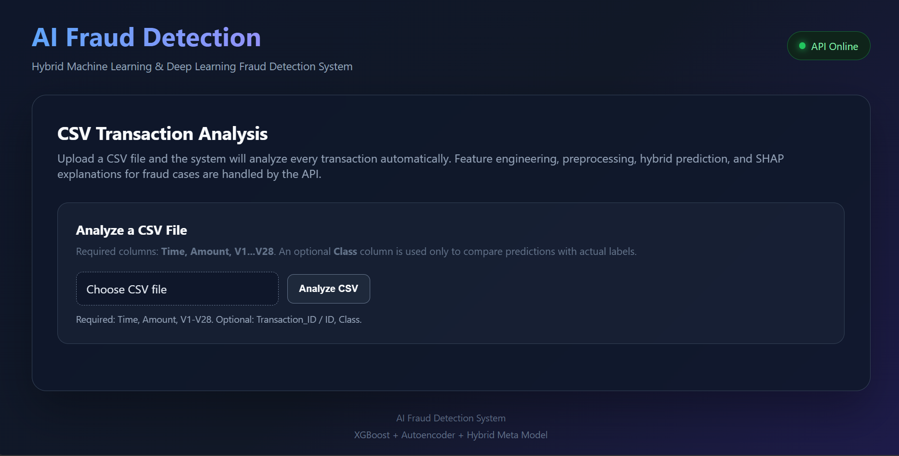
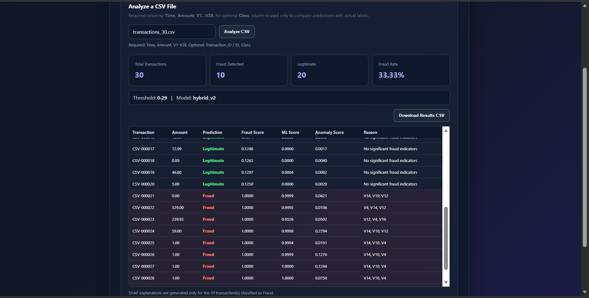

# 🛡️ AI Fraud Detection System

An end-to-end **Hybrid AI Fraud Detection System** for analyzing financial transactions and identifying potentially fraudulent activity.

The system combines:
- **XGBoost** for supervised fraud classification
- **PyTorch Autoencoder** for anomaly detection
- **Hybrid / Meta Model** for the final fraud score
- **SHAP** for fraud-only explainability
- **FastAPI** for backend inference
- **Web Frontend** for CSV-based transaction analysis
- **SQLite** for application history
- **Pytest** for automated testing

---

## 🎯 Project Objectives

- Detect fraudulent financial transactions using Machine Learning and Deep Learning.
- Combine supervised fraud probability with anomaly detection.
- Produce a unified final fraud score through a Hybrid Model.
- Explain fraudulent predictions using SHAP.
- Allow users to upload a CSV file and analyze multiple transactions automatically.
- Provide a complete, testable end-to-end application.

---

## 🧠 System Architecture

```text
                     ┌──────────────────────┐
                     │      CSV Upload      │
                     │   Time, Amount, V1-V28│
                     └──────────┬───────────┘
                                │
                                ▼
                     ┌──────────────────────┐
                     │    Preprocessing     │
                     │ Feature Engineering  │
                     └──────────┬───────────┘
                                │
                    ┌───────────┴───────────┐
                    │                       │
                    ▼                       ▼
           ┌─────────────────┐     ┌──────────────────┐
           │ XGBoost Model   │     │ PyTorch          │
           │ Supervised ML   │     │ Autoencoder      │
           └────────┬────────┘     └────────┬─────────┘
                    │                       │
                    │ Fraud Probability    │ Anomaly Score
                    └───────────┬───────────┘
                                ▼
                     ┌──────────────────────┐
                     │    Hybrid Model      │
                     │  Final Fraud Score   │
                     └──────────┬───────────┘
                                │
                       ┌────────┴────────┐
                       │                 │
                       ▼                 ▼
                 Legitimate           Fraud
                                         │
                                         ▼
                                  ┌──────────────┐
                                  │     SHAP     │
                                  │ Explanation  │
                                  └──────────────┘
```

---

## 👥 Team Members & Responsibilities

### 👩‍💻 P1 — Ghada Mohamed
**Data, EDA, Preprocessing & Feature Engineering**

Responsibilities:
- Dataset preparation and cleaning.
- Exploratory Data Analysis (EDA).
- Data validation.
- Leakage-safe preprocessing.
- Feature engineering.
- Preparing the reusable preprocessing pipeline.
- Preparing scaling / transformation components.
- Ensuring the same feature representation is used during training and inference.

---

### 👩‍💻 P2 — Tukka Mohamed
**Supervised Machine Learning — XGBoost**

Responsibilities:
- Building the supervised fraud-detection branch.
- Training the XGBoost classifier.
- Handling the highly imbalanced fraud/legitimate classes.
- Model evaluation.
- Generating fraud probabilities.
- Saving the trained XGBoost model.
- Preparing the ML artifacts required by the hybrid system.

---

### 👨‍💻 P3 — Ahmed Hesham
**Deep Learning — PyTorch Autoencoder**

Responsibilities:
- Designing the Deep Learning anomaly-detection branch.
- Building the PyTorch Autoencoder.
- Training the Autoencoder primarily on legitimate/normal transactions.
- Calculating reconstruction error (MSE).
- Generating anomaly scores.
- Determining the anomaly threshold.
- Saving the trained Autoencoder model.

---

### 👩‍💻 P4 — Mariam Mohamed
**Hybrid Model, SHAP, FastAPI, SQLite & System Integration**

Responsibilities:
- Building and integrating the Hybrid / Meta Model.
- Combining XGBoost fraud probability with the Autoencoder anomaly score.
- Producing the final fraud score.
- Implementing SHAP explainability for fraud predictions.
- Building the FastAPI backend.
- Connecting the trained models to the API.
- Implementing CSV batch prediction.
- Integrating the frontend with the backend.
- Integrating SQLite for transaction/history storage.
- Implementing and running API/preprocessing tests.
- Final end-to-end system integration and deployment preparation.

---

## 🔬 Machine Learning

### XGBoost

The supervised branch learns from labeled transactions and produces:

```text
ML Fraud Probability
```

This probability is passed to the Hybrid Model.

---

## 🧠 Deep Learning

### PyTorch Autoencoder

The Autoencoder learns the patterns of legitimate transactions.

When a transaction is significantly different from learned normal behavior, its reconstruction error increases.

Output:

```text
Anomaly Score
```

---

## 🔗 Hybrid Model

The Hybrid Model combines the two model signals:

```text
XGBoost Fraud Probability
            +
Autoencoder Anomaly Score
            ↓
      Hybrid / Meta Model
            ↓
     Final Fraud Score
```

The final score is used to classify each transaction as:

```text
Fraud
```

or:

```text
Legitimate
```

---

## 🔍 Explainable AI — SHAP

SHAP is used specifically for transactions predicted as **Fraud**.

The system identifies the features that contributed most strongly to the supervised fraud prediction.

This provides a more interpretable result instead of returning only:

```text
Fraud
```

---

## 🌐 Web Application

The application provides a CSV-based workflow.

### User Workflow

```text
Upload CSV
    ↓
Validate CSV
    ↓
Preprocess Transactions
    ↓
XGBoost Prediction
    ↓
Autoencoder Anomaly Detection
    ↓
Hybrid Fraud Score
    ↓
Fraud / Legitimate
    ↓
SHAP Explanation for Fraud
    ↓
Display Results
    ↓
Download Results
```

### Expected CSV Columns

```text
Time
Amount
V1
V2
...
V28
```

The `Class` column is optional and can be used when comparing predictions against known labels.

---

## 📸 Application Screenshots

### Screenshot 1



**Image path:**
```text
screenshoots/screen_1.png
```

### Screenshot 2



**Image path:**
```text
screenshoots/screen_2.png
```

---

## 🛠️ Technologies Used

| Category | Technologies |
|---|---|
| Programming | Python, JavaScript, HTML, CSS |
| Machine Learning | XGBoost, Scikit-learn |
| Deep Learning | PyTorch |
| Data Processing | Pandas, NumPy |
| Explainable AI | SHAP |
| Backend | FastAPI, Uvicorn |
| Database | SQLite |
| Testing | Pytest |
| Development | Jupyter Notebook, Git, GitHub |

---

## 📁 Project Structure

```text
AI-Fraud-Detection-System/
│
├── artifacts/
│   ├── anomaly_scaler.pkl
│   ├── feature_config.json
│   ├── hybrid_config.json
│   ├── meta_model.pkl
│   ├── model_config.json
│   ├── preprocessing_pipeline.pkl
│   └── xgboost_model.pkl
│
├── backend/
│   └── main.py
│
├── data/
│   ├── transactions_30.csv
│   └── processed/
│       ├── train.csv
│       ├── validation.csv
│       └── test.csv
│
├── database/
│   └── db.py
│
├── frontend/
│   ├── index.html
│   ├── script.js
│   └── style.css
│
├── models/
│   └── autoencoder.pth
│
├── notebooks/
│   ├── 02_ml_xgboost_training.ipynb
│   ├── 03_dl_pytorch_autoencoder.ipynb
│   └── 04_hybrid_model_evaluation.ipynb
│
├── reports/
│   ├── class_distribution.png
│   ├── data_report.md
│   ├── shap_feature_importance.csv
│   ├── shap_feature_importance_fraud_only.csv
│   ├── xgboost_confusion_matrices.json
│   └── xgboost_metrics.csv
│
├── screenshoots/
│   ├── screen_1.png
│   └── screen_2.png
│
├── src/
│   ├── dl_pipeline.py
│   ├── ensemble.py
│   ├── evaluation.py
│   ├── explainability.py
│   ├── features.py
│   └── preprocessing.py
│
├── tests/
│   ├── test_api_contract.py
│   └── test_preprocessing.py
│
├── .gitignore
├── requirements.txt
└── README.md
```

---

## 🧪 Testing

The project includes automated tests using Pytest.

Run:

```bash
pytest -v
```

The tests cover:

- API contract validation.
- Raw data loading.
- Target-column validation.
- Feature consistency across splits.
- Feature-order consistency.
- Preprocessing pipeline loading.
- Sample transaction transformation.
- Expected transformed feature count.
- NaN and infinity checks.
- Train/validation/test split checks.
- Class representation.
- Pipeline determinism.

---

## 🚀 Installation

### 1. Clone the Repository

```bash
git clone <YOUR_GITHUB_REPOSITORY_URL>
cd AI-Fraud-Detection-System
```

### 2. Create a Virtual Environment

Windows:

```bash
python -m venv venv
venv\Scripts\activate
```

### 3. Install Dependencies

```bash
pip install -r requirements.txt
```

---

## ▶️ Run the Application

Start the FastAPI server:

```bash
uvicorn backend.main:app --reload
```

Then open:

```text
http://127.0.0.1:8000/
```

The frontend and backend are served through the same FastAPI application.

---

## 📓 Notebooks

### `02_ml_xgboost_training.ipynb`

Contains the supervised Machine Learning development and XGBoost training workflow.

### `03_dl_pytorch_autoencoder.ipynb`

Contains the PyTorch Autoencoder development and anomaly-detection workflow.

### `04_hybrid_model_evaluation.ipynb`

Contains Hybrid Model integration and evaluation.

---

## 📊 Reports

The `reports/` directory contains:

- Class distribution analysis.
- XGBoost metrics.
- Confusion matrices.
- SHAP feature importance.
- Fraud-only SHAP feature importance.
- Data analysis report.

---

## 🔐 Data & Privacy

The transaction dataset uses anonymized numerical features.

`V1`–`V28` represent anonymized transaction characteristics rather than directly understandable financial attributes.

---

## ⭐ Key Features

- ✅ Supervised XGBoost fraud detection
- ✅ PyTorch Autoencoder anomaly detection
- ✅ Hybrid / Meta Model
- ✅ Fraud probability scoring
- ✅ Anomaly scoring
- ✅ Fraud-only SHAP explanations
- ✅ CSV batch analysis
- ✅ FastAPI backend
- ✅ Integrated web frontend
- ✅ SQLite history
- ✅ Automated testing
- ✅ Reusable preprocessing pipeline
- ✅ Saved model artifacts
- ✅ GitHub-ready project structure

---

## 👥 Team

**Ghada Mohamed · Tukka Mohamed · Ahmed Hesham · Mariam Mohamed**

**AI Fraud Detection System — End-to-End Hybrid ML/DL Project**